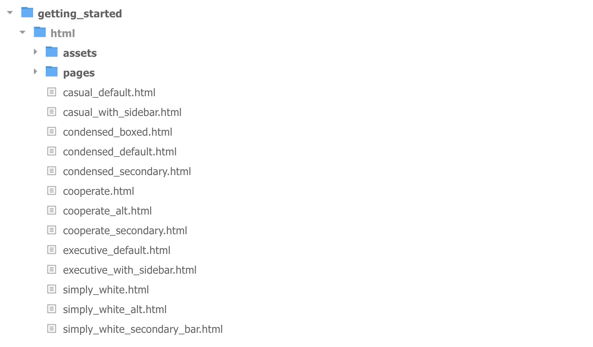

# Getting Started

## Introduction

Pages is carefully well thought UI frame work that is built on top of Bootstrap 4, Its hand crafted components look great on all devices and works super fast even on mobile

This documentation guide for all Pages users who can even be a beginner to Web development  

#### Light Weight & Ready to Go

The entire set of modules clocks in at 52KB\* minified and gzipped. Crafted with mobile devices in mind, it was important to us to keep our file sizes small, and every line of CSS was carefully considered. If you decide to only use a subset of these modules, you'll save even more bytes.

Production level usage using minified and gzipped files

## Getting Started

This part of the doc will help you to quickly start your project and will you a basic idea about how pages work. For you to get started visit the "Get Started" folder in your download package

**What's Included**

Pages come in two forms, within which you'll find the following directories and files, logically grouping common resources and providing both compiled and minified variations

Once you have download the package you will see the following folder structure

### **What's Inside getting\_started**

This folder is a boilerplate template to help you start your project.

**Folder : assets**

This folder is entirely dedicated for you and you can add your own images, custom css and js files, its grouped into resource folders for best practice  

**Folder : pages**

This where the magic happens and contains pre-complied version of Pages, we do recommend updating any contents of the folder as all future updates are affected directly to this  

**What's Inside demo**

This folder contains all the demo files that we have shown in the live version for reference, you may wish to import code to your project from that. This is only used for reference and we do not recommend to start your project from demo files.  

**What's Inside grunt and gulp**

Pages support two popular build systems called Grunt and Gulp.

