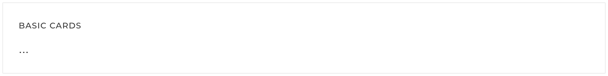
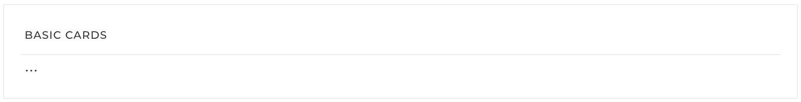
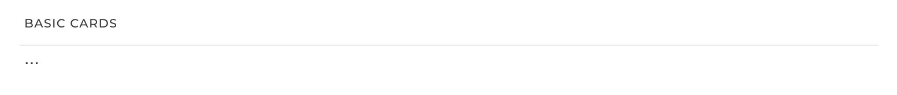
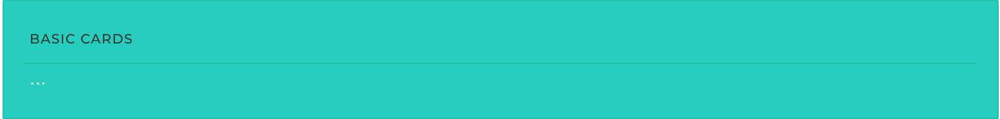
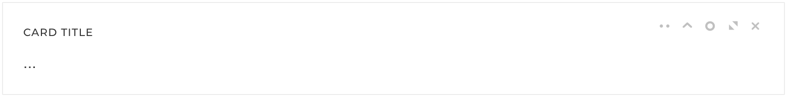

# Cards

Basic Cards in Pages follow the exact same markup of `.cards` in Bootstrap. Going a step further we have added Card tools to enhance your web app experience.



## **Basic Card**

**Card scroll**



Create a basic Card using `.card` just like in Bootstrap. To make the Card body scrollable, simply add `.scrollable` to the `.card-block`. Then create a new wrapper element as the immediate child of the `.card-block` containing the all the content and set it a `height` or `max-height`

### HTML

```markup
<div class="card card-default">
    <div class="card-header">
        <div class="card-title">Basic Cards
        </div>
    </div>
    <div class="card-block scrollable">
      <!-- REMOVE THIS WRAPPER IF .scrollable IS NOT USED -->
        <div style="max-height:130px">
          ...
        </div>
    </div>
</div>
```

### **Style options**



Append `.separator` to your `.card-header` to separator between card header and card bodyBASIC CARDS...

```markup
<div class="card card-default">
    <div class="card-header separator">
        <div class="card-title">Basic Cards
        </div>
    </div>
    <div class="card-block">
      ...
    </div>
</div>
```

Replace `.card-default` with `.card-transparent` to make the background of a Card transparentBASIC CARDS...



```markup
<div class="card card-transparent">
    <div class="card-header">
        <div class="card-title">Basic Cards
        </div>
    </div>
    <div class="card-block">
      ...
    </div>
</div>
```

Use any contextual background color with Cards by appending `.bg-*` \(ex: `.bg-success`\) to `.card` . Text color of the card body can also be changed by adding any `.text-*` contextual color classBASIC CARDS...



```markup
<div class="card card-default bg-success text-white">
    <div class="card-header">
        <div class="card-title">Basic Cards
        </div>
    </div>
    <div class="card-block">
      ...
    </div>
</div>
```

Append `.card-condensed` to reduce padding of `.card-header` and `.card-block`BASIC CARDS...

```markup
<div class="card card-default card-condensed">
    <div class="card-header">
        <div class="card-title">Basic Cards
        </div>
    </div>
    <div class="card-block">
      ...
    </div>
</div>
```

## **Advance Card**

**Example**

Convert traditional Bootstrap cards into Cards using Pages Cards jQuery plugin. The following Card controls are available:

* Collapse
* Refresh
* Close
* Settings
* Resize



```markup
<div id="myCard" class="card card-default">
    <div class="card-header ">
        <div class="card-title">Card Title
        </div>
        <div class="card-controls">
            <ul>
                <li>
                    <div class="dropdown">
                        <a id="card-settings" data-target="#" href="#" data-toggle="dropdown" aria-haspopup="true" role="button" aria-expanded="false">
                            <i class="card-icon card-icon-settings "></i>
                        </a>

                        <ul class="dropdown-menu pull-right" role="menu" aria-labelledby="card-settings">
                            <li><a href="#">Item 1</a></li>
                            <li><a href="#">Item 2</a></li>   
                        </ul>
                    </div>
                </li>
                <li><a href="#" class="card-collapse" data-toggle="collapse"><i class="card-icon card-icon-collapse"></i></a>
                </li>
                <li><a href="#" class="card-refresh" data-toggle="refresh"><i class="card-icon card-icon-refresh"></i></a>
                </li>
                <li><a href="#" class="card-maximize" data-toggle="maximize"><i class="card-icon card-icon-maximize"></i></a>
                </li>
                <li><a href="#" class="card-close" data-toggle="close"><i class="card-icon card-icon-close"></i></a>
                </li>
            </ul>
        </div>
    </div>
    <div class="card-block">
        ...
    </div>
</div>
<script>
$(function(){
  $('#myCard').card({
        onRefresh: function() {
            // Timeout to simulate AJAX response delay
            setTimeout(function() {
                $('#myCard').card({
                    refresh: false
                });
            }, 2000);
        }
    });
});
</script>
```

### **Usage**

Cards can be initialized using either data attributes or via Javascript. However if you need to have a refresh button within your Card it is a must that you follow the latter which enables you to bind a refresh callback function.

Via data attributes

```markup
<div class="card card-default" data-pages="card">
    <div class="card-header ">
        <div class="card-title">Card Title
        </div>
        <div class="card-controls">
            <ul>
                <li><a href="#" class="card-close" data-toggle="close"><i class="card-icon card-icon-close"></i></a>
                </li>
            </ul>
        </div>
    </div>
    <div class="card-block">
        ...
    </div>
</div>
```

Via Javascript

```text
<script>
$(function() {
    $('#myCard').card(options)
})
</script>
```

### Options

| `NAME` | `TYPE` | `DEFAULT` | `DESCRIPTION` |
| :--- | :--- | :--- | :--- |
| progress | string | 'circle' | Sets the progress indicator which is shown when the refresh button is clicked. Styles available are 'bar', 'circle' and 'circle-lg' |
| progressColor | string | 'master' | Change the color of the progress indicator. Follows the Pages [contextual color](http://pages.revox.io/dashboard/3.0.0/docs/partials/color.html) naming convention. Note: 'white' color is only available for progress 'circle-lg' |
| refresh | boolean | false | Toggle progress indicator by setting this option. ex: Set this to 'false' from inside `onRefresh` function to hide the progress indicator |
| error | string | null | Slide-in an error message inside the Card. Recommended to be used when notifying the user about a failed refresh callback |
| overlayColor | string | 'white' | Change the color of overlay which is shown while the refresh process is in progress. Any hex color code is accepted |
| overlayOpacity | number | 0.6 | Change the opacity of the overlay. Use any value between 0 and 1 |
| onRefresh | function | undefined | Called when the \[data-toggle="refresh"\] button is clicked |
| onCollapse | function | undefined | Called when the \[data-toggle="collapse"\] button is clicked |
| onExpand | function | undefined | Called when the \[data-toggle="refresh"\] button is clicked while the Card is being collapsed |
| onMaximize | function | undefined | Called when the \[data-toggle="maximize"\] button is clicked |
| onRestore | function | undefined | Called when the \[data-toggle="maximize"\] button is clicked while the Card is being maximized |
| onClose | function | undefined | Called when the \[data-toggle="close"\] button is clicked |

