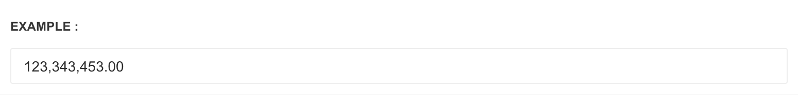

# Autonumeric

[autoNumeric](http://www.decorplanit.com/plugin/) is a jQuery plugin that automatically formats currency and numbers as you type on form inputs.


Please refer to [jQuery autoNumeric Documentation](http://www.decorplanit.com/plugin/) to learn about plugin options


**Step one**

Include the javascript file inside the `<body>`before core template script inclusions, if it's not there already. Please view [jQuery plugin inclusion guideline rules](http://pages.revox.io/dashboard/3.0.0/docs/partials/js_rules.html)

```markup
<script src="assets/plugins/jquery-autonumeric/autoNumeric.js" type="text/javascript">
```

**Step two**

Add the markup.

```markup
<input type="text" data-a-dec="." data-a-sep="," class="autonumeric form-control">
```

**Step three**

Apply the plugin.


Make sure you place the following script **below** all the pre-requisites mentioned in the Step two above.




```markup
<script>
$(document).ready(function() {
    $('.autonumeric').autoNumeric('init');
});
</script>
```

