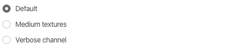

# Checkboxes and Radio

Get rid of native look n' feel with our very own custom checkboxes written purely in CSS. These are retina compatible and available in all Bootstrap's contextual classes \(ex: `.primary`\)

## Checkbox


```markup
<div class="form-check">
	<input type="checkbox" id="defaultCheck" checked>
	<label for="defaultCheck">
		Default checkbox
	</label>
</div>
<div class="form-check complete">
	<input type="checkbox" id="checkColorOpt1">
	<label for="checkColorOpt1">
		I agree to the terms and conditions
	</label>
</div>
<div class="form-check primary">
	<input type="checkbox" id="checkColorOpt2" checked>
	<label for="checkColorOpt2">
		Mark as read
	</label>
</div>
```

### **Shape options**

Bored with traditional boxed shape check boxes? Here is a circle one simply add the class `.checkbox-circle` to change it


```markup
<div class="form-check checkbox-circle danger">
	<input type="checkbox" id="checkcircleColorOpt1">
	<label for="checkcircleColorOpt1">
		Delete all personal settings
	</label>
</div>
<div class="form-check checkbox-circle complete">
	<input type="checkbox" id="checkcircleColorOpt2" checked>
	<label for="checkcircleColorOpt2">
		Keep me signed in
	</label>
</div>
```

### **State options**

These act the same way as normal HTML check boxes. Here are some states that


```markup
<div class="form-check form-check-inline complete">
	<input type="checkbox" id="checkboxIndeterminate">
	<label for="checkboxIndeterminate">
		Indeterminate
	</label>
</div>
<div class="form-check form-check-inline">
	<input type="checkbox" id="disableCheck" checked disabled>
	<label for="disableCheck">
		Disabled checkbox
	</label>
</div>
```

## **Toggle controls**

Do not delete the `label` element which is placed next to each `radio`. Leave it blank if you don't want it to hold any text



```markup
<div class="form-check">
	<input type="radio" name="texture" id="defaultradio" value="Default" checked>
	<label for="defaultradio">
		Default
	</label>
</div>
<div class="form-check complete">
	<input type="radio" name="texture" id="radio1" value="Medium">
	<label for="radio1">
		Medium textures
	</label>
</div>
<div class="form-check primary">
	<input type="radio" name="texture" id="radio2" value="Verbose">
	<label for="radio2">
		Verbose channel
	</label>
</div>
```

### **State options**

Use of different color opacity helps to distinguish between different states such as disable


```markup
<div class="form-check form-check-inline complete">
	<input type="radio" name="state" id="radioInline" value="Default" checked>
	<label for="radioInline">
		Default
	</label>
</div>
<div class="form-check form-check-inline">
	<input type="radio" name="state" id="radioDisabled" value="disabled" disabled>
	<label for="radioDisabled">
		Disabled
	</label>
</div>
```

