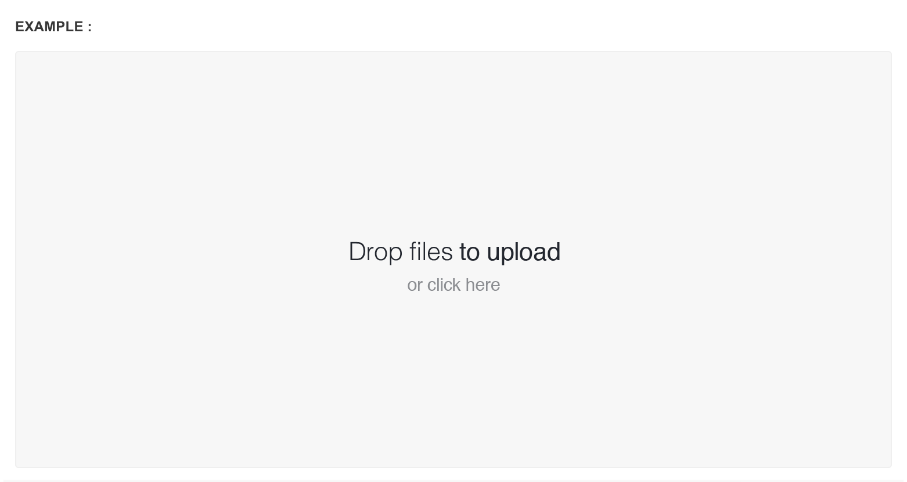

# File Upload

[DropzoneJS](http://www.dropzonejs.com/) is an open source library that provides drag'n'drop file uploads with image previews.


Please refer to [DropzoneJS Documentation](http://www.dropzonejs.com/) to learn about plugin options


**Step one**

Include the stylesheet `dropzone.css` inside the `<head>` if it's not there already.

```markup
<link type="text/css" rel="stylesheet" href="assets/plugins/dropzone/css/dropzone.css">
```

**Step two**

Include the javascript file inside the `<body>`before core template script inclusions, if it's not there already.

```markup
<script src="assets/plugins/dropzone/dropzone.min.js" type="text/javascript"></script>
```

**Step three**

Add `.dropzone` to initialize dropzone plugin with default options.



```markup
<form action="/file-upload" class="dropzone">
    <div class="fallback">
        <input name="file" type="file" multiple />
    </div>
</form>
```

