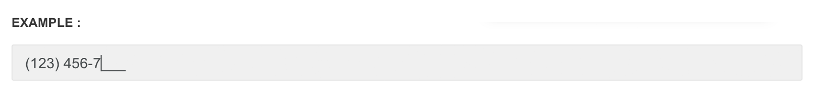

# Masked Input

Allows the user to enter fixed width input while conforming to a character format. Powered by [jQuery Masked Input](http://digitalbush.com/projects/masked-input-plugin/) plugin.


Please refer to [jQuery Masked Input Documentation](http://digitalbush.com/projects/masked-input-plugin/) to learn about plugin options


**Step one**

Include the javascript file inside the `<body>`before core template script inclusions, if it's not there already. Please view [jQuery plugin inclusion guideline rules](http://pages.revox.io/dashboard/3.0.0/docs/partials/js_rules.html)

```markup
<script src="assets/plugins/jquery-inputmask/jquery.inputmask.min.js" type="text/javascript">
```

**Step two**

Add the markup.

```markup
<input type="text" id="phone" class="form-control">
```

**Step three**

Apply the plugin.


Make sure you place the following script **below** all the pre-requisites mentioned in the Step two above.




```markup
<script>
$(document).ready(function() {
    $("#phone").mask("(999) 999-9999");
});
</script>
```

