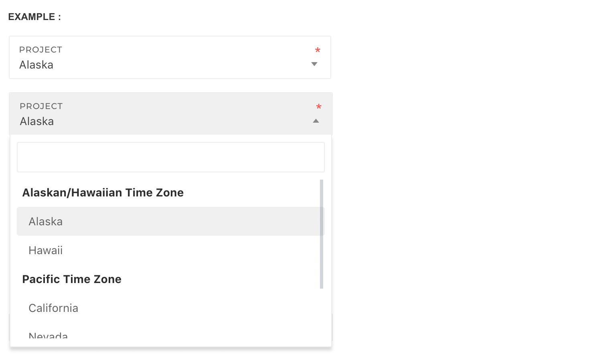

# Selectbox

## **Default select**

Default select depends on [classie.js](https://github.com/desandro/classie). Make sure it's included inside the `<body>` before core template script inclusions.

```markup
<script src="assets/plugins/classie/classie.js" type="text/javascript"></script>
```

Add `.cs-select` and `.cs-skin-slide` to any `<select>` control to add a cool animation effect


```markup
<select class="cs-select cs-skin-slide" data-init-plugin="cs-select">
    <option value="Web-safe">Web-safe</option>
    <option value="Helvetica">Helvetica</option>
    <option value="SegeoUI">SegeoUI</option>
</select>
```

## **Advance Select**

Pages uses [Select2](https://select2.org/) jQuery plugin for advance selects with search facility. Follow these steps to initialize the plugin

**Step one**

Include the stylesheet `select2.css` inside the `<head>` if it's not there already. 

```markup
<link media="screen" type="text/css" rel="stylesheet" href="assets/plugins/bootstrap-select2/select2.css">
```

**Step two**

Include the required javascript files inside the `<body>` before core template script inclusions, if they are not there already.

```markup
<script src="assets/plugins/bootstrap-select2/select2.min.js" type="text/javascript"></script>
```

**Step three**

Append data attribute `data-init-plugin="select2"` to initialize any `<select>` automatically with basic options. Avoid auto-initializing when you want to have advance options

```markup
<form role="form">
    <div class="form-group">
        <!-- Using data-init-plugin='select2' automatically initializes a basic Select2 -->
        <select class="full-width" data-init-plugin="select2">
            <optgroup label="Alaskan/Hawaiian Time Zone">
                <option value="AK">Alaska</option>
                <option value="HI">Hawaii</option>
            </optgroup>
            <optgroup label="Pacific Time Zone">
                <option value="CA">California</option>
                <option value="NV">Nevada</option>
                <option value="OR">Oregon</option>
                <option value="WA">Washington</option>
            </optgroup>
        </select>
    </div>

    <div class="form-group">
        <!-- Element intended to use with advance options -->
        <input type="hidden" id="mySelect2" class="full-width">
    </div>
</form>
```

**Step four**

Apply the plugin to your desired element


Make sure you place the following script **below** all the pre-requisites mentioned in the Step two above.




```markup
<script>
$(document).ready(function() {
    // Avoid applying plugin to <select> with data-init-plugin="select2"

    // Only apply on elements that don't have data-init-plugin="select2" 
    $("#mySelect2").select2({
        placeholder: "Select a type",
        data: [{
            id: 0,
            text: 'enhancement'
        }, {
            id: 1,
            text: 'bug'
        }, {
            id: 2,
            text: 'duplicate'
        }]
    });
});
</script>
```


jQuery validation and select2 is not directly compatible. Use the following code to fix it


```javascript
$("#SELECTBOX_ID").change(function(){ 
    $(this).trigger("blur"); 
});
```

