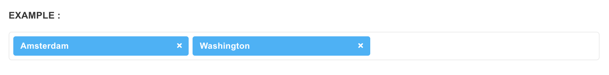

# Tags Input

[jQuery tags input](https://github.com/timschlechter/bootstrap-tagsinput) plugin is based on Twitter Bootstrap.


Please refer to [jQuery tags input Documentation](https://github.com/timschlechter/bootstrap-tagsinput) to learn about plugin options


**Step one**

Include the stylesheet `bootstrap-tagsinput.css` inside the `<head>` if it's not there already. 

```markup
<link type="text/css" rel="stylesheet" href="assets/plugins/bootstrap-tag/bootstrap-tagsinput.css">
```

**Step two**

Include the javascript file inside the `<body>`before core template script inclusions, if it's not there already.

```markup
<script src="assets/plugins/bootstrap-tag/bootstrap-tagsinput.min.js" type="text/javascript"></script>
```

**Step two**

Add the markup.

```markup
<input id="#tagsinput" type="text" value="Amsterdam,Washington" data-role="tagsinput" />
```

**Step three**

Apply the plugin.


Make sure you place the following script **below** all the pre-requisites mentioned in the Step two above.




```markup
<script>
$(document).ready(function() {
    $('#tagsinput').tagsinput({
        typeahead: {
            source: ['Amsterdam', 'Washington', 'Sydney', 'Beijing', 'Cairo']
        }
    });
});
</script>
```

