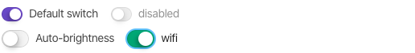

# Toggle

Pages comes with native CSS toggle, no third party bulky JS includes just simple HTML checkboxes



```markup
<div>
	<div class="form-check form-check-inline switch">
		<input type="checkbox" id="pagesSwitch" checked>
		<label for="pagesSwitch">Default switch</label>
	</div>
	<div class="form-check form-check-inline switch">
		<input type="checkbox" id="switchDisabled" disabled>
		<label for="switchDisabled"> disabled </label>
	</div>
</div>
<div>
	<div class="form-check form-check-inline switch switch-lg complete">
		<input type="checkbox" id="switch-lg">
		<label for="switch-lg">Auto-brightness</label>
	</div>
	<div class="form-check form-check-inline switch switch-lg success">
		<input type="checkbox" id="switchColorOpt">
		<label for="switchColorOpt">wifi </label>
	</div>
</div>
```

