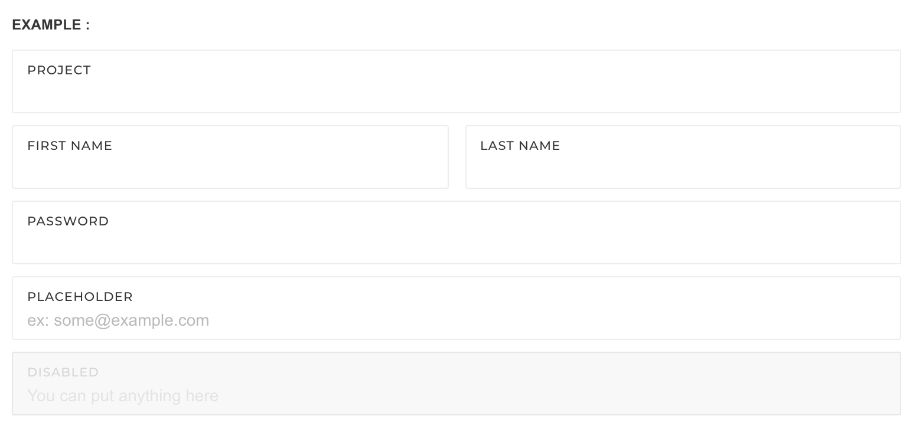

# Form Layouts

This section of the documentation will guide you how to apply different form styles for your need, There 3 different new styles that you an use, Please follow the steps in achieving this. There is no need of external JS or CSS libraries.

## Creating a Standard Bootstrap Form

To create a native bootstrap form, the following tags are a must, It is the standard procedure in Bootstrap


1. You should have a form tag
2. A label for your input is conditional
3. Both label and input should be wrapped in `form-group`

```text
<form role="form">
  <div class="form-group">
    <label for="exampleInputEmail1">Email address</label>
    <input type="email" class="form-control" id="exampleInputEmail1" placeholder="Enter email">
  </div>
  <div class="form-group">
    <label for="exampleInputPassword1">Password</label>
    <input type="password" class="form-control" id="exampleInputPassword1" placeholder="Password">
  </div>
  <button type="submit" class="btn btn-default">Submit</button>
</form>
```


For more detailed documentation of Bootstrap forms [ Bootstrap Form Guideline](http://getbootstrap.com/css/#forms)


## Pages Default Form Layout

To create a pages default form layout, append the class `form-group-default` to `form-group`. But first you must create a bootstrap form [Click here to see](http://pages.revox.io/dashboard/3.0.0/docs/partials/form_layouts.html#standardbsform)




```markup
<form role="form">
    
    <div class="form-group form-group-default ">
        <label>Project</label>
        <input type="email" class="form-control" required>
    </div>

    <div class="row">
        <div class="col-sm-6">
            <div class="form-group form-group-default">
                <label>First name</label>
                <input type="text" class="form-control" required>
            </div>
        </div>
        <div class="col-sm-6">
            <div class="form-group form-group-default">
                <label>Last name</label>
                <input type="text" class="form-control">
            </div>
        </div>
    </div>

    <div class="form-group form-group-default">
        <label>Password</label>
        <input type="password" class="form-control" required>
    </div>

    <div class="form-group form-group-default">
        <label>Placeholder</label>
        <input type="email" class="form-control" placeholder="ex: some@example.com" required>
    </div>

    <div class="form-group form-group-default disabled">
        <label>Disabled</label>
        <input type="email" class="form-control" value="You can put anything here" disabled>
    </div>
</form>
```

## Pages Attached Form Layout

To create a attached form layout follow the following steps

1. Create a form following the [Pages Default Form layout](http://pages.revox.io/dashboard/3.0.0/docs/partials/form_layouts.html#defaultform). Attached layout can ONLY be applied to the Pages Default style.
2. Wrap a set of `form-group-default` elements with `form-group-attached`

EXAMPLE :PROJECT NAMEFIRST NAMELAST NAME

```markup
<form role="form">
    <div class="form-group-attached">
        <div class="form-group form-group-default required">
            <label>Project name</label>
            <input type="text" class="form-control" name="projectName" required>
        </div>
        <div class="row clearfix">
            <div class="col-sm-6">
                <div class="form-group form-group-default required">
                    <label>First name</label>
                    <input type="text" class="form-control" name="firstName" required>
                </div>
            </div>
            <div class="col-sm-6">
                <div class="form-group form-group-default">
                    <label>Last name</label>
                    <input type="text" class="form-control" name="lastName">
                </div>
            </div>
        </div>
    </div>
</form>
```

## Pages Horizontal Form Layout

To create a pages default form layout, add the class `form-horizontal`. First you must create a bootstrap form [Click here to see](http://pages.revox.io/dashboard/3.0.0/docs/partials/form_layouts.html#standardbsform)

EXAMPLE :

```markup
<form class="form-horizontal" role="form">
...
</form>
```

