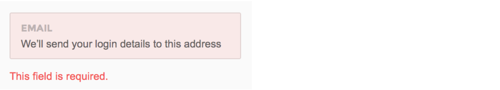
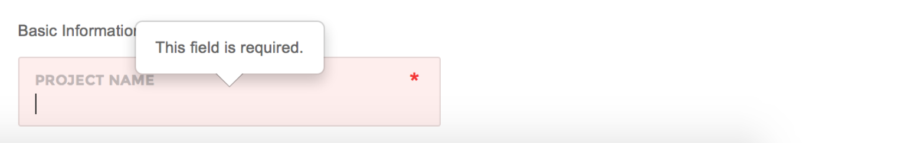

# Form Validation

Pages is packaged with [jQuery Validation Plugin](http://jqueryvalidation.org/) which is currently the de-facto plugin for form validation.


Please refer to [jQuery Validation Plugin Documentation](http://jqueryvalidation.org/) to learn about plugin options


**Step one**

Include the relevant javascript files inside the `<body>`before core template script inclusions, if it's not there already.

```markup
<script type="text/javascript" src="assets/plugins/jquery-validation/js/jquery.validate.min.js">
```

**Step two**

Create the markup.

```markup
<form id="myForm" role="form">
    <div class="row">
        <div class="col-sm-6">
            <div class="form-group form-group-default required">
                <label>First name</label>
                <input type="text" class="form-control" name="firstName" minlength="2" required>
            </div>
        </div>
        <div class="col-sm-6">
            <div class="form-group form-group-default">
                <label>Last name</label>
                <input type="text" class="form-control" name="lastName" minlength="2" required>
            </div>
        </div>
    </div>
    <button class="btn btn-primary" type="submit">Register</button>
</form>
```

**Step three**

Apply the plugin.

```markup
<script>
$(document).ready(function() {
    $('#myForm').validate();
});
</script>
```

## **Error messages**

`showErrors` and `errorPlacement` functions of jQuery Validate have been overridden in Pages core. As a result, the way error messages are displayed will differ depending on the [form layout style](http://pages.revox.io/dashboard/3.0.0/docs/partials/form_elements.html) you've declared in the code

### **Standard**

Standard way of showing error messages. Will appear on any form except for forms with [attached groups](http://pages.revox.io/dashboard/3.0.0/docs/partials/form_elements.html).



### **Attached**

Recommended to use with Pages [default form style](http://pages.revox.io/dashboard/3.0.0/docs/partials/form_elements.html) having attached elements with `.form-group-attached` wrapper. The error messages will appear in the form of popovers.



