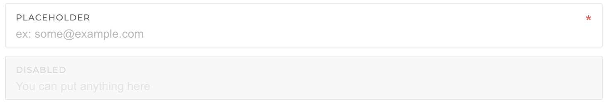

# Form Group

## Importing

First import it to your app module or any submodule as you wish

```typescript
import { SharedModule } from './@pages/components/shared.module';
@NgModule({
  imports: [SharedModule,...]
})
export class AppModule(){}
```

## Usage

Place "pgFormGroupDefault" in bootstrap forum-group div





```markup
<div class="form-group form-group-default required " pgFormGroupDefault>
    <label>Project</label>
    <input type="email" class="form-control" required >
</div>
```




