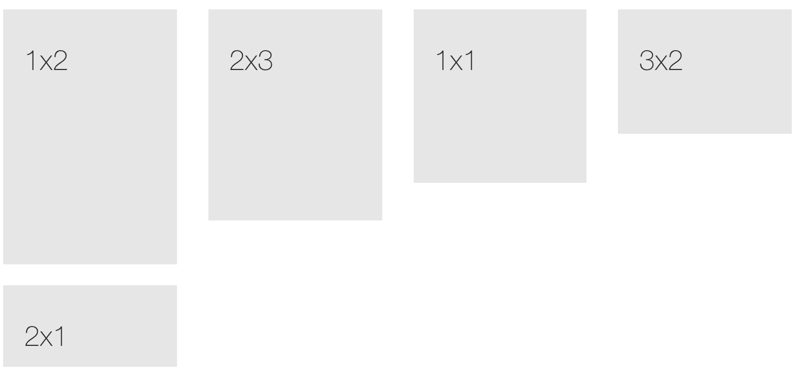

# Helpers

**Pages helper css classes allow you to build your custom layout without touching any CSS code**

These classes are generic helper classes predifined in the CSS of pages, here is quick view what they can do

* Set margins - Available for all directions from 5 - 90 px stepping value 5px
* Set padding - Available for all directions from 5 - 90 px stepping value 5px
* Set border - Available for all sides, default pages border color
* Border Radius - Option to set border radius, size sm / md / lg
* Image wrapping - Circular image wrap with custom size, sm / md / lg

## Margins

You can add this helper class to any element in your HTML code to set Margins

| `FIRST PREFIX ( M-*)` | `SECOND PREFIX(M-T/B/L/R-*)` | `LAST PREFIX(M-T-$VALUE)` |
| :--- | :--- | :--- |
| m for margin | t : top, b : bottom, l : left, r : right | 5,10,15,20, ... 90 |


`m-t-10` which means Margin Top 10px   
`m-b-20` which means Margin Bottom 20px   
`m-l-5` which means Margin Left 5px   
`m-r-35` which means Margin Right 35px 


RULE :

> Value can not be anything, 1,2,4,5,6. It has a step of 5px, eg: 5,10,15

OTHER OPTIONS :

> To remove margin from a HTML element add the class `no-margin`

## Padding

You can add this helper class to any element in your HTML code to set Padding

| `FIRST PREFIX ( P-*)` | `SECOND PREFIX(P-T/B/L/R-*)` | `LAST PREFIX(P-T-$VALUE)` |
| :--- | :--- | :--- |
| p for padding | t : top, b : bottom, l : left, r : right | 5,10,15,20, ... 90 |


`p-t-10` which means Padding Top 10px   
`p-b-20` which means Padding Bottom 20px   
`p-l-5` which means Padding Left 5px   
`p-r-35` which means Padding Right 35px 


> Value can not be anything, 1,2,4,5,6. It has a step of 5px, eg: 5,10,15

OTHER OPTIONS :

To remove padding from a HTML element add the class `no-padding`

## Border

You can add this helper class to any element in your HTML code to set Border, border currently supports one pixel

| `FIRST PREFIX ( B-*)` | `SECOND PREFIX(B-T/B/L/R/A-*)` |
| :--- | :--- |
| b for border | t : top, b : bottom, l : left, r : right, a : all |

**Border Color**

By default pages is shipped with border helper classes are of two

`b-transparent` 40% opacity

`b-grey`

`b-primary`

`b-success`

`b-complete`

`b-danger`

`b-warning`

EXAMPLE :

```markup
<div class="b-b b-grey">
  I have a bottom border 
</div>
```

### **Border Style**

`b-dashed` - change the border style to 'dashed'

`b-thick` - change the border width to 2px

### **Border Radius**

Helpy class to apply quick border radius, you can change the value in misc.less or in style.css

| CLASS | DESCRIPTION |
| :--- | :--- |
| `b-rad-sm` | 3px border radius |
| `b-rad-md` | 5px border radius |
| `b-rad-lg` | 7px border radius |

## Table-like behavior

Add table behavior to any `div` by using these helper classes. These classes will come handy when you want to vertically align any content like in native `table`s.


I'm top aligned just like in a table-cellI'm middle aligned just like in a table-cell


```markup
<div class="container-sm-height bg-master-lighter" style="height:200px">
    <div style="height:50px" class="row row-sm-height b-b b-grey">
        <div class="col-sm-12 col-sm-height col-top ">
            <span class="hint-text">I'm top aligned just like in a table-cell</span>
        </div>
    </div>

    <div class="row row-sm-height ">
        <div class="col-sm-12 col-sm-height col-middle ">
            <span class="hint-text">I'm middle aligned just like in a table-cell</span>
        </div>
    </div>
</div>
```

The table created in the above example is only activated for resolutions ≥768px. Hence the prefix `*-sm-*`. You can replace `*-sm-*` with any other breakpoint prefix defined in Bootstrap to restrict the table-like behavior to a particular resolution \(ex: 'xs','md','lg'\)

You can also append `col-middle`, `col-top` or `col-bottom` to `col-*-height` to vertically align the content

It is also possible to mix these classes together with Bootstrap's `row` and `col-*-*` classes without any conflict

## Elements that resize maintaining aspect ratio

Make the height of any element auto-adjust depending on its width while constraining to a given aspect ratio.



```markup
<div class="row">
    <div class="col-sm-3">
        <div class="ar-1-2">
            <div class="bg-master-light padding-20">
                <h3>1x2</h3>
            </div>
        </div>
    </div>

    <div class="col-sm-3">
        <div class="ar-2-3">
            <div class="bg-master-light padding-20">
                <h3>2x3</h3>
            </div>
        </div>
    </div>

    <div class="col-sm-3">
        <div class="ar-1-1">
            <div class="bg-master-light padding-20">
                <h3>1x1</h3>
            </div>
        </div>
    </div>

    <div class="col-sm-3">
        <div class="ar-3-2">
            <div class="bg-master-light padding-20">
                <h3>3x2</h3>
            </div>
        </div>
    </div>

    <div class="col-sm-3 m-t-20">
        <div class="ar-2-1">
            <div class="bg-master-light padding-20">
                <h3>2x1</h3>
            </div>
        </div>
    </div>
</div>
```

## Absolute positioning

Makes elements to have `position:absolute`. Add `.relative` to the parent of the element that you want to be absolute to have relative positioning


Like - Top-left, Bottom-left, Top-right & Bottom-right


```markup
<div class="relative" style="height:300px">
    <!-- Equivalent to "pull-up" -->
    <div class="top-left bg-master-light text-center padding-20">Top-left</div>
    <!-- Equivalent to "pull-bottom" -->
    <div class="bottom-left bg-master-light text-center padding-20">Bottom-left</div>
    <div class="top-right bg-master-light text-center padding-20">Top-right</div>
    <div class="bottom-right bg-master-light text-center padding-20">Bottom-right</div>
</div>
```

It is also possible to mix two or more classes. ex: Mixing `top-left top-right` will produce the following CSS styling`top:0; left:0; right:0`

## **Misc. classes**

| CLASS NAME | DESCRIPTION |
| :--- | :--- |
| `full-width` | Spans the element to have 100% width of the parent |
| `full-height` | Spans the element to have 100% height of the parent |
| `scrollable` | Adds `overflow-y:auto` |
| `center-margin` | Adds `margin-left:auto; margin-right:auto`. Useful when center aligning any div |
| `inherit-size` | Inherits width and height from parent |
| `inherit-height` | Inherits only the height from parent |
| `hide` | Hides any element |
| `inline` | Adds `display:inline-block` |

