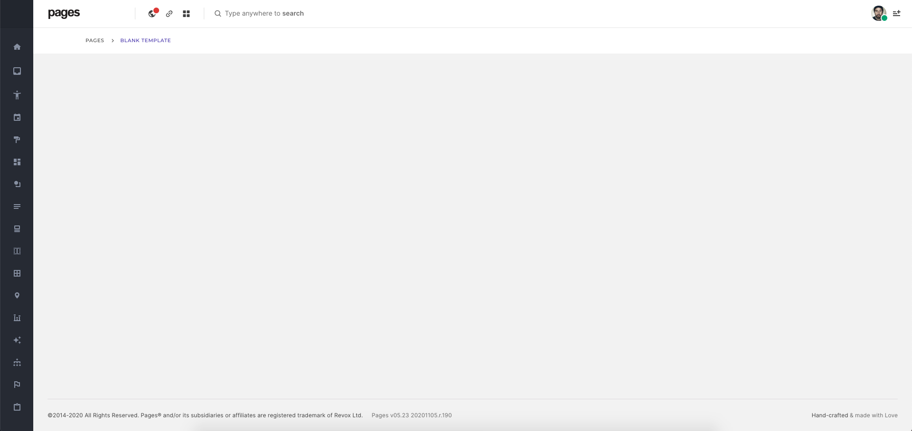
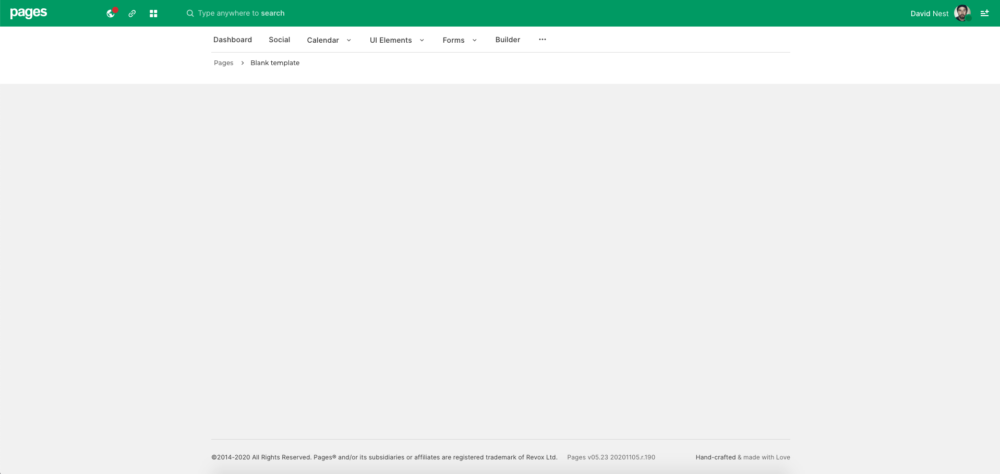
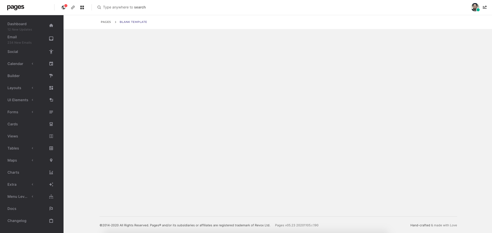
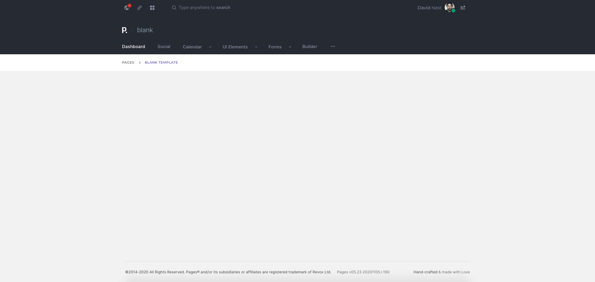

# Layouts

## **Pages Condensed**

One of our most popular Layouts, Pages Condensed offers a wide range of responsive space specifically for dashboards with heavy content.   
  
**File location**  
Quick start -`getting_started/html/condensed_layout.html`  
Demo Files -`demo/html/consended/`

## **Pages Casual**

A new tone of voice – a relaxed, friendly, joyful layout that quickly makes the user experience more personal, casual and fun!. Comes with horizontal layout and sidebar option   
  
Quick start -`getting_started/html/casual_default.html`  
Demo Files -`demo/html/casual/`

## **Pages Corporate**

Corporate is a bold, cool Layout that elevates your content by utilizing a clean layout and a simple, open interface. Contains boxed version and secondary sidebar.   
  
Quick start -`getting_started/html/corporate.html`  
Demo Files -`demo/html/corporate/`

## **Simply White**

In a world of complexity, Simplicity defeats stress. Simply white is an open simple, minimal yet striking layout, built to combat stress. Contains boxed version and secondary sidebar.   
  
Quick start -`getting_started/html/simply_white.html`  
Demo Files -`demo/html/simply_white/`

## **Executive**

A Professional template with a timeless look, best suited to quickly create a serious organized experience. Comes with horizontal layout and sidebar option   
  
Quick start -`getting_started/html/executive_default.html`  
Demo Files -`demo/html/executive/`

Once you decided the layout you wish to you use, copy all the folders and the layout html file \(eg:executive\_default.html\) to your project folder and work from there. The folders include

* pages
* assets

Next select the theme you want to use



