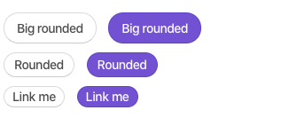

# Buttons

## **Colors**

Pages buttons use the same contextual classes introduced in Bootstrap


```markup
<button class="btn btn-primary">Primary</button>
<button class="btn btn-success">Success</button>
<button class="btn btn-complete">Complete</button>
<button class="btn btn-info">Info</button>
<button class="btn btn-warning">Warning</button>
<button class="btn btn-danger">Danger</button>
```

## **Button animation**

Content inside a button can be animate on hover. Simply include the classes `.btn-animated` together with `.from-top` or `.from-left` to specify the animation direction, You can wish to have any icon you want in side the "hidden-block" div


```markup
<button
  aria-label=""
  type="button"
  class="btn btn-primary btn-cons btn-animated from-left"
>
  <span>Follow us</span>
  <span class="hidden-block">
    <i class="pg-icon">mail</i>
  </span>
</button>
<button
  aria-label=""
  type="button"
  class="btn btn-primary btn-cons btn-animated from-top"
>
  <span>Download</span>
  <span class="hidden-block">
    <i class="pg-icon">cloud</i>
  </span>
</button>
```

## **Default Dropdown**

Tired of seeing the standard Bootstrap dropdown? Wrap your dropdown toggle button and dropdown menu within `.dropdown-default` to get a modern and clean feel


```markup
<div class="btn-group dropdown-default">
    <a class="btn dropdown-toggle" data-toggle="dropdown" href="#"> Dropdown <span class="caret"></span> </a>
    <ul class="dropdown-menu ">
        <li><a href="#">Arial</a>
        </li>
        <li><a href="#">Helvetica</a>
        </li>
        <li><a href="#">SegeoUI</a>
        </li>
    </ul>
</div>
<!-- Upside dropdown -->
<div class="btn-group dropdown-default dropup">
    <a class="btn dropdown-toggle" data-toggle="dropdown" href="#"> Dropdown <span class="caret"></span> </a>
    <ul class="dropdown-menu ">
        <li><a href="#">Arial</a>
        </li>
        <li><a href="#">Helvetica</a>
        </li>
        <li><a href="#">SegeoUI</a>
        </li>
    </ul>
</div>
```

## **Tag Options**

Add `.btn-tag` followed by `.btn-tag-light` or `.btn-tag-dark` to have tag options with color variations for buttons. Additionally, rounded tags can be achieved by adding `.btn-tag-rounded`


```markup
<!-- Tag with a light background -->
<button class="btn btn-tag  btn-tag-light m-r-20">Link me</button>
<!-- Tag with a dark background -->
<button class="btn btn-tag  btn-tag-dark">Link me</button>
<!-- Rounded tag with a light background -->
<button class="btn btn-tag   btn-tag-light btn-tag-rounded m-r-20">Link me</button>
<!-- Rounded tag with a dark background -->
<button class="btn btn-tag   btn-tag-dark btn-tag-rounded">Link me</button>
```

## **Rounded buttons**

Any button can be made to have rounded corners by adding `.btn-rounded`



```markup
<!-- Large rounded button -->
<button class="btn btn-lg btn-rounded">Large rounded</button>

<!-- Regular rounded button -->
<button class="btn btn-rounded">Regular</button>

<!-- Small rounded button -->
<button class="btn btn-sm btn-rounded">Small</button>
```

