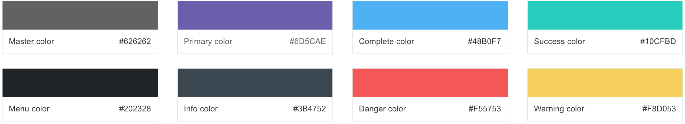
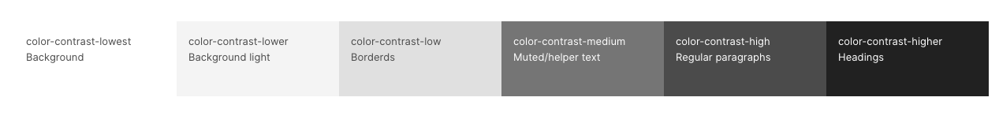
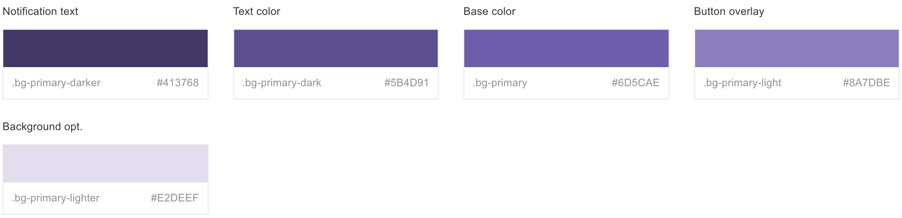
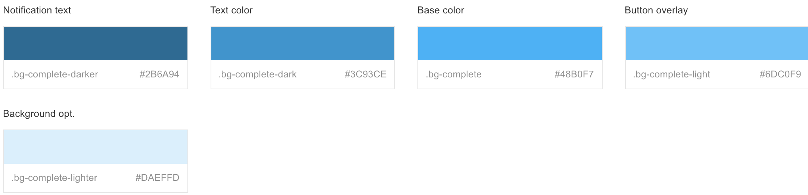
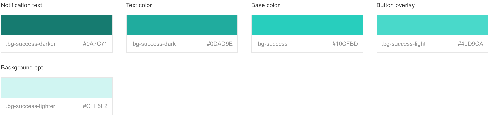
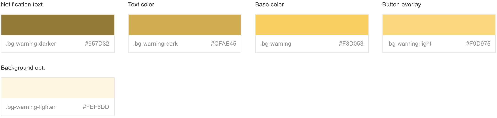
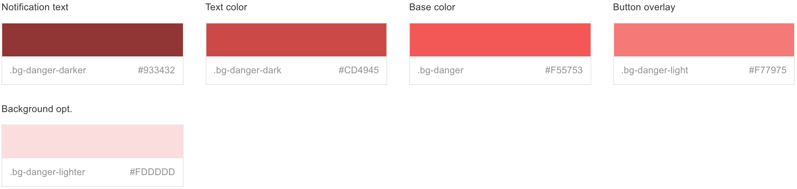
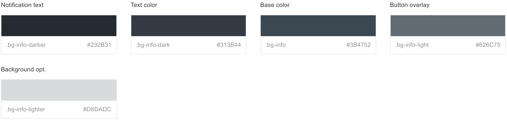
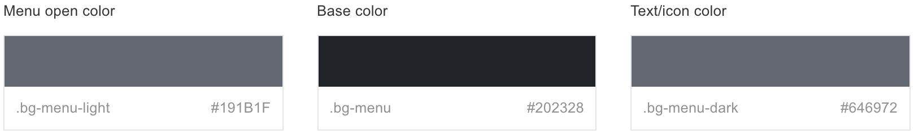
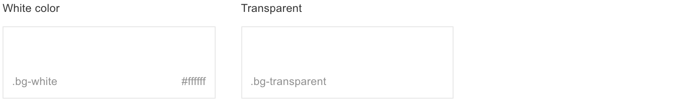

# Color

Every color used throughout the theme has been generated by using the following eight base colors, which are defined in the`var.scss`file. This makes theme customisation a matter of changing few SCSS variables.

Please refer for more on theme customisation

## **Monochrome color shades**

## **Primary color shades**

## **Complete color shades**

## **Success color shades**

## **Warning color shades**

## **Danger color shades**

## **Info color shades**

## **Menu color shades**

## **Other colors**

