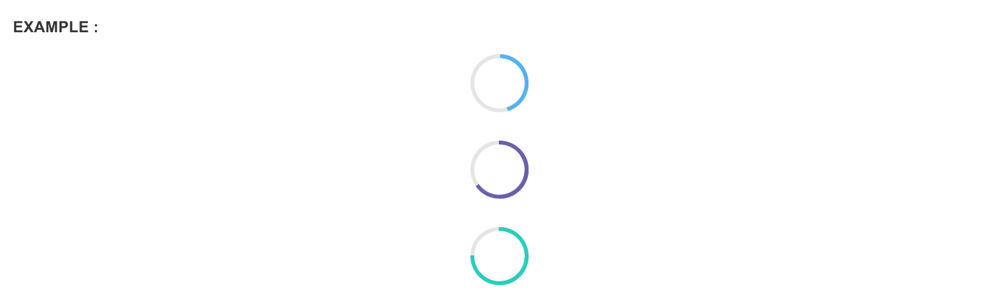

# Progressbar

## **Linear Progress**

### **Indeterminate progress**

Indicates a running process where the progress is unknown using an animated svg. ex: AJAX form submission. Simply wrap `.progress-bar-indeterminate` with Bootstrap's `.progress`. The progress bar will automatically expand to get the width of its parent `<div>`


```markup
<div style="width:50%">
    <div class="progress">
        <div class="progress-bar-indeterminate"></div>
    </div>
    </div>
</div>
```

#### **Color options**

In addition to Bootstrap's contextual progress bar classes, Pages has introduced two new classes, `.progress-bar-success`and `.progress-bar-complete` if you want to add more color to your project


```markup
<div style="width:50%">
    <div class="progress">
        <div class="progress-bar progress-bar-primary" style="width: 35%;"></div>
    </div>
    <div class="progress">
        <div class="progress-bar progress-bar-complete" style="width: 45%;"></div>
    </div>
</div>
```

**Size options**

Append `.progress-small` to `.progress` to make the progress bars thinner than the usual height


```markup
<div style="width:50%">
    <!-- Thinner progress bar -->
    <div class="progress progress-small">
        <div style="width: 45%;" class="progress-bar progress-bar-success"></div>
    </div>
    <!-- Default height -->
    <div class="progress">
        <div style="width: 45%;" class="progress-bar progress-bar-success"></div>
    </div>
</div>
```

## **Circular Progress**

Don't like the linear style? Try circular progress indicators instead. These also come with determinate and inderminate options

### **Indeterminate progress**


```markup
<div class="progress-circle-indeterminate"></div>
```

### **Determinate progress**

A determinate circular progress indicator can be initialized without writing a single line of Javascript code by simply including markup below. Pass any percentage value \(0-100\) into the `value` field to set the progress


```markup
<!-- Show 75% of progress -->
<input class="progress-circle" data-pages-progress="circle" value="75" type="hidden" data-color="complete">
```

**Color options**

Color options can be set using the `data-color` attribute. Any contextual color can be included.  




```markup
<input class="progress-circle" data-pages-progress="circle" value="45" type="hidden" data-color="complete">
<input class="progress-circle" data-pages-progress="circle" value="65" type="hidden" data-color="primary">
<input class="progress-circle" data-pages-progress="circle" value="75" type="hidden" data-color="success">
```

**Size options**

Stroke of the circle can be made thicker by setting `data-thick="true"`


```markup
<input class="progress-circle" data-pages-progress="circle" value="75" type="hidden" data-thick="true">
```

