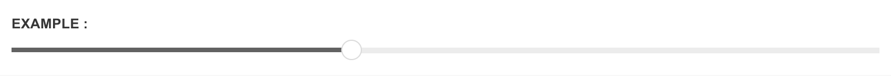
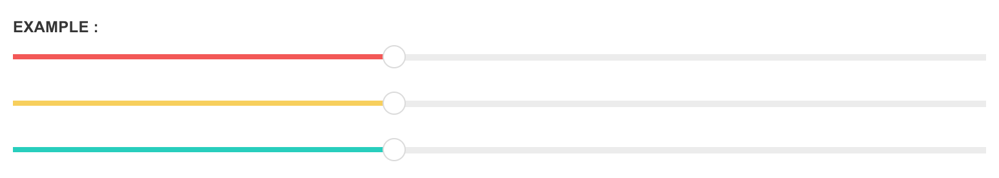
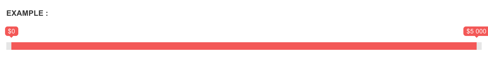
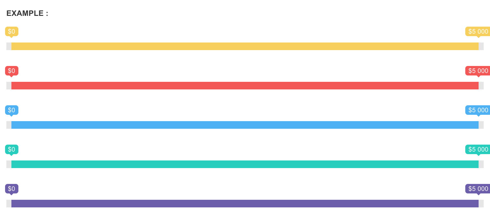

# Sliders

Sliders in Pages are powered by [noUiSlider](http://refreshless.com/nouislider/) and [Ion.RangeSlider](http://ionden.com/a/plugins/ion.rangeSlider/en.html), which are lightweight jQuery Range Slider plugins that come with tons of options and support for multiple devices.

## **noUiSlider**

Follow these steps to include noUiSlider in your page

**Step one**

Include stylesheet `jquery.nouislider.css` inside the `<head>`

```markup
<link media="screen" type="text/css" rel="stylesheet" href="assets/plugins/jquery-nouislider/jquery.nouislider.css">
```

**Step two**

Include the relevant javascript files inside the `<body>` before core template script inclusions

```markup
<script type="text/javascript" src="assets/plugins/jquery-nouislider/jquery.nouislider.min.js">
<script type="text/javascript" src="assets/plugins/jquery-nouislider/jquery.liblink.js">
```

**Step three**

Apply the plugin to your desired element



```markup
<!-- Element to be used with the plugin -->
<div id="noUiSlider" class="bg-master"></div>

<script>
$(document).ready(function() {
    // Apply the plugin to the element
    $("#noUiSlider").noUiSlider({
        start: 40,
        connect: "lower",
        range: {
            'min': 0,
            'max': 100
        }
    });
});
</script>
```

### **Color options**

Slider color can be changed by appending the pre-defined classes. Please refer to [Color guide](http://pages.revox.io/dashboard/3.0.0/docs/partials/sliders.html#) for all the color options



```markup
<div id="noUiSliderOne" class="bg-danger"></div>
<div id="noUiSliderTwo" class="bg-warning"></div>
<div id="noUiSliderThree" class="bg-success"></div>
```

## **Ion.RangeSlider**

Follow these steps to include Ion.RangeSlider in your page

**Step one**

Include the necessary stylesheet files inside the `<head>`

```markup
<link media="screen" type="text/css" rel="stylesheet" href="assets/plugins/ion-slider/css/ion.rangeSlider.css">
<link media="screen" type="text/css" rel="stylesheet" href="assets/plugins/ion-slider/css/ion.rangeSlider.skinFlat.css">
```

**Step two**

Include the relevant javascript files inside the `<body>` before core template script inclusions

```markup
<script type="text/javascript" src="assets/plugins/ion-slider/js/ion.rangeSlider.min.js"></script>
```

**Step three**

Apply the plugin to your desired element



```markup
<!-- Element to be used with the plugin -->
<div class="irs-wrapper">
    <input type="text" id="ionSlider" name="ionSlider" value="0;2057" />
</div>

<script>
$(document).ready(function() {
    // Apply the plugin to the element
    $("#ionSlider").ionRangeSlider({
        min: 0,
        max: 5000,
        type: 'double',
        prefix: "$",
        maxPostfix: "+",
        prettify: false,
        hasGrid: true
    });
});
</script>
```

### **Color options**

Slider color can be changed by appending the pre-defined classes.



```markup
<div class="irs-wrapper warning">
    <input type="text" id="ionSliderOne" name="ionSlider" value="0;2057" />
</div>

<div class="irs-wrapper danger">
    <input type="text" id="ionSliderTwo" name="ionSlider" value="0;2057" />
</div>

<div class="irs-wrapper complete">
    <input type="text" id="ionSliderFour" name="ionSlider" value="0;2057" />
</div>

<div class="irs-wrapper success">
    <input type="text" id="ionSliderThree" name="ionSlider" value="0;2057" />
</div>

<div class="irs-wrapper primary">
    <input type="text" id="ionSliderFour" name="ionSlider" value="0;2057" />
</div>
```

