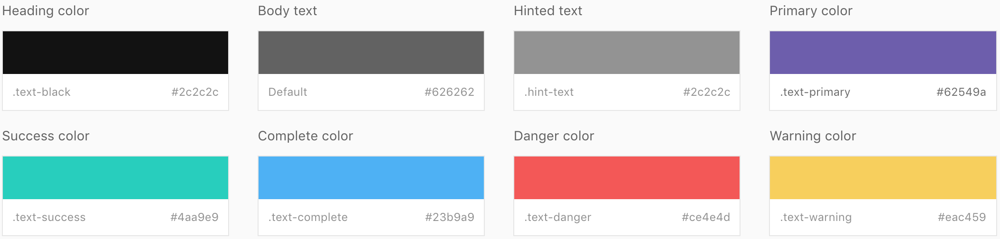
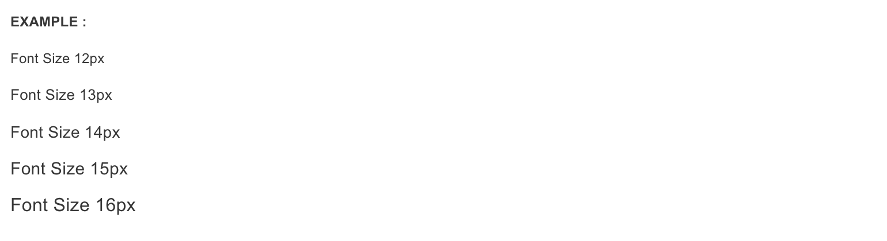
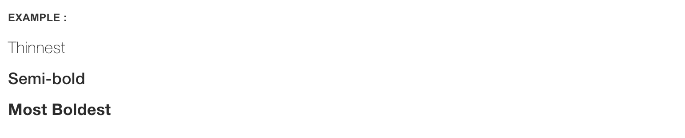
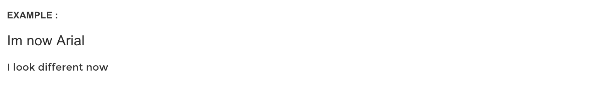

# Typopgrahy

Font rendering will differ from browser to browser and even platform to platform and sometimes it will look good on a Mac and would look horrible on Windows, this is something we see in most of the websites, We took web framework to whole new level where it looks good in all devices! no matter what platform browser or device you will you use it will look great

We used a method that will automatically select which font is best rendered as for your operating system. This is how it the render performance looks like

## **Heading Fonts**

| `PLATFORM` | `BASE FONT` | `FALL BACK` |
| :--- | :--- | :--- |
| Mac OSX | Helvetica Neue | Arial |
| Windows | SegeoUI | Arial |
| Linux | Ubuntu | Arial |
| iOS | Helvetica Neue | Arial |
| Android | Helvetica Neue | Arial |
| Windows Mobile | SegeoUI | Arial |

### **Base Font**

**Arial**, The best Universal Multi-purpose. 98% Rendering rate   
The Arial® typeface : http://www.fonts.com/font/monotype/arial  


### **Other Fonts**

MONTSERRAT   
The Montserrat® typeface : http://www.google.com/ fonts/specimen/Montserrat

## **Font Color Classes**

You can add these classes to any element and its color of the font will change

eg :



```markup
<!-- In Paragraph -->
<p class="text-primary">Font Colour Changes! </p>

<!-- In any other tag -->
<div class="text-success">Font Colour Changes! </div>
```

### **Font Size Classes**

If you wish to change the default font size, then you can apply the following classes

eg :



```markup
<!-- In Font Size 12 -->
<p class="fs-12">Font Size 12px </p>

<!-- In Font Size 13 -->
<p class="fs-13">Font Size 13px </p>

<!-- In Font Size 14 -->
<p class="fs-14">Font Size 14px </p>

<!-- In Font Size 15 -->
<p class="fs-15">Font Size 15px </p>

<!-- In Font Size 16 -->
<p class="fs-16">Font Size 16px </p>
```

### **Font Weights**

Try out different font weights, this can be applied if the font supports it only, works partial support for Arial - Paragraphs Full support for Headings

eg :



```markup
<!-- Heading Light Weight -->
<h5 class="light">Thinnest</h5>

<!-- Heading Semi-bold Weight -->
<h5 class="semi-bold">Semi-bold</h5>

<!-- Heading bold Weight -->
<h5 class="bold">Most Boldest</h5>
```

### **Font Face Switching**

Apply heading font to paragraph or apply paragraph font to heading, you can switch it either way

eg :



```markup
<!-- Heading with Arial font -->
<h5 class="font-arial">Im now Arial</h5>

<!-- Paragraph with heading font -->
<p class="font-montserrat">I look different now</p>
```

