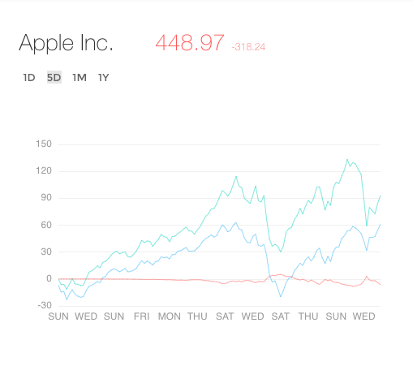
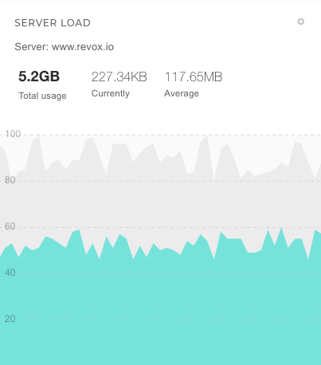
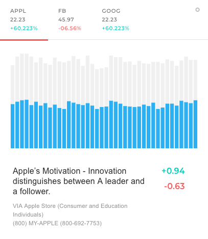

# Widgets

Pages comes with 24 pre-built widget components that you can easily integrate with your dashboards in no time. These can be found in `dashboard/widgets`folder and each widget folder is named after its `@Component`'s `selector.`Widgets are based off [pgcard component](ui-components/cards.md) 

## Importing

Widgets are available throughout all the pre-built dashboards via `dashboard.module.ts`. But if you are planning use them outside you will have to import them as below. 

```typescript
// Using ImageWidgetComponent as an example. Same steps apply to other widgets
import { ImageWidgetComponent } from './widgets/image-widget/image-widget.component';
@NgModule({
  declarations: [ImageWidgetComponent,...]
})
export class AppModule(){}
```

## bar-tile-widget

Features a stacked bar chart made with `echarts` component:

```http
<bar-tile-widget></bar-tile-widget>
```


## graph-live-widget

Features a looping vertical slider with stock market updates. 

```http
<graph-live-widget></graph-live-widget>
```


## graph-options-widget

Features a line chart with toggle buttons. 

```http
<graph-options-widget></graph-options-widget>
```


## graph-tile-flat-widget

Features a line chart with sales stats. 

```http
<graph-tile-flat-widget></graph-tile-flat-widget>
```


## graph-tile-widget

Features a line chart with area filled in. 

```http
<graph-tile-widget></graph-tile-widget>
```


## graph-widget

Features a line chart with multiple series of data.

```http
<graph-widget></graph-widget>
```

| **Property** | **Description** | **Type** | **Default** |
| :--- | :--- | :--- | :--- |
| `IsAlt` | Toggles three boxes with stock trading highlights and a search bar | boolean | false |




## image-widget

Features a background image and an text overlay. 

```http
<image-widget></image-widget>
```


## image-widget-basic

Features a background image and a text overlay. Intended to use for showing minimal content. 

```http
<image-widget-basic></image-widget-basic>
```


## plain-live-widget

Features a rotating text

```http
<plain-live-widget></plain-live-widget>
```


## plain-widget

Features quick weather info 

```http
<plain-widget></plain-widget>
```


## progress-tile-flat-widget

Features a large title text and a progress bar

```http
<progress-tile-flat-widget></progress-tile-flat-widget>
```


## project-progress-widget

Features multiple progress bars in a tab view. 

```http
<project-progress-widget></project-progress-widget>
```


## quick-stats-widget

Features quick stats in extra large text and a progress bar.

```http
<quick-stats-widget></quick-stats-widget>
```


## realtime-widget

Designed to show live streaming data in a line chart. Demo widget represents sample data updated using a timer. 

```http
<realtime-widget></realtime-widget>
```



## social-image-tile-widget

Shows an image in the style of a social feed post. 

```http
<social-image-tile-widget></social-image-tile-widget>
```


## social-post-tile-widget

Shows a social post with text and an image. 

```http
<social-post-tile-widget></social-post-tile-widget>
```


## stacked-bar-widget

Features a [pg-tabset](ui-components/tabs.md) component with stacked bar charts representing multiple data sources for quick comparison.  

```http
<stacked-bar-widget></stacked-bar-widget>
```



## stat-tile-widget

This is also another mini widget similar to `quick-stats-widget` and `progress-tile-flat widget`. Sample widget illustrates stock trading stats  

```http
<stat-tile-widget></stat-tile-widget>
```


## table-basic-widget

Features a basic table layout.  

```http
<table-basic-widget></table-basic-widget>
```


## table-widget

This is another variation of `table-basic-widget.` 

```http
<table-widget></table-widget>
```


## todo-list-widget

Show todo-list items with checkboxes. 

```http
<todo-list-widget></todo-list-widget>
```


## weather-widget

Shows weekly weather data together with animated weather icons from [Skycons](https://github.com/darkskyapp/skycons). 

```http
<todo-list-widget></todo-list-widget>
```

| **Property** | **Description** | **Type** | **Default** |
| :--- | :--- | :--- | :--- |
| `Type` | By default weather widget shows two highlighted columns with weather data to the right in extra large screens. Set this to "compact" to disable them.  | string | undefined |


## weekly-sales-widget

This is also another mini widget showing weekly sales data.  

```http
<weekly-sales-widget></weekly-sales-widget>
```


